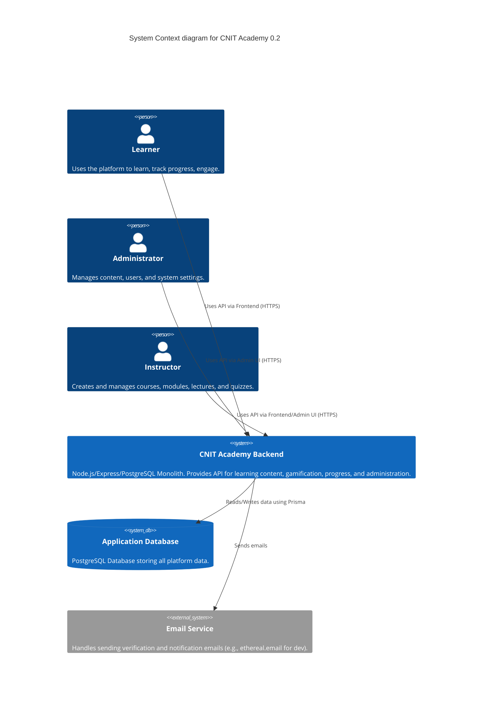
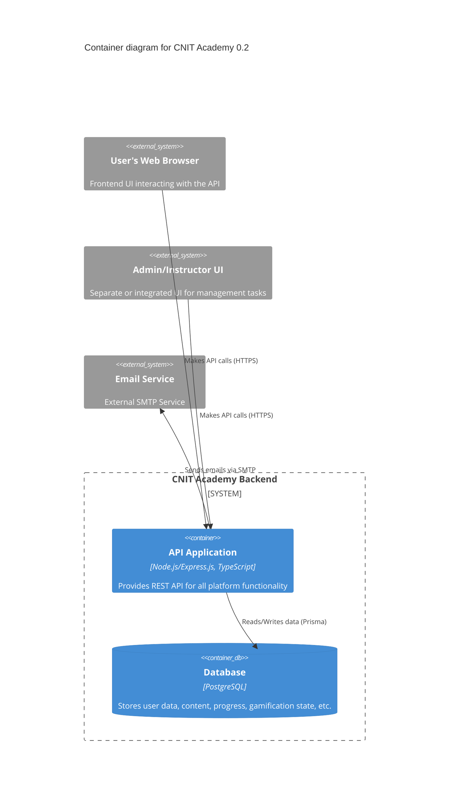
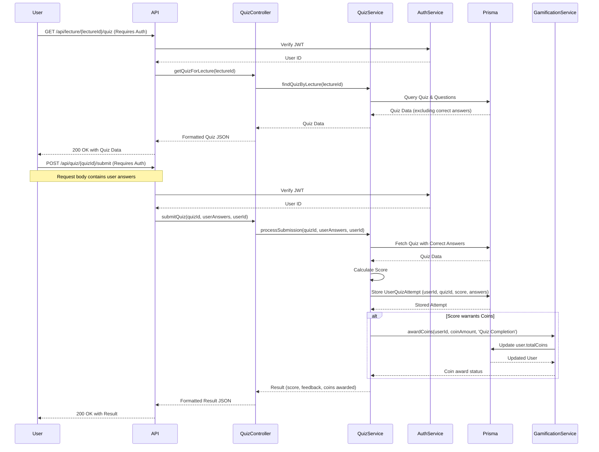
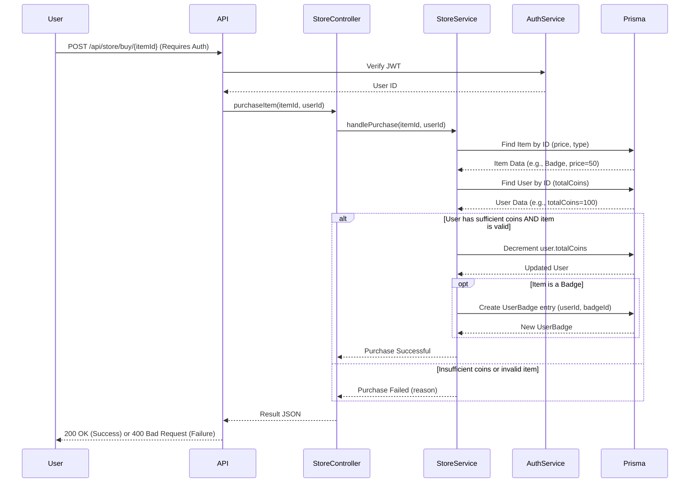

# Architecture for CNIT Academy 0.2

Status: Draft

## Technical Summary

This document outlines the architecture for CNIT Academy 0.2, enhancing the existing monolithic Node.js/Express backend. It incorporates new features including gamification (coin store, badges, streaks), improved content structure (modules), basic assessments (quizzes), community features (blog comments), role-based access control (Admin/Instructor), and enhanced progress tracking. The architecture maintains the current RESTful API approach, utilizes Prisma with a PostgreSQL database (targetting production, currently SQLite in development), and follows the existing controller/service pattern. New components for managing modules, quizzes, comments, badges, roles, and the coin store will be added, integrating with existing user, course, and lecture services.

## Technology Table

| Technology   | Version         | Description                                                                                                |
| ------------ | --------------- | ---------------------------------------------------------------------------------------------------------- |
| Node.js      | >=18            | JavaScript runtime environment                                                                             |
| TypeScript   | Latest          | Superset of JavaScript adding static types                                                                 |
| Express.js   | Latest          | Web application framework for Node.js                                                                      |
| Prisma       | Latest          | Next-generation ORM for Node.js and TypeScript (connecting to PostgreSQL)                                  |
| PostgreSQL   | >=14 (Target)   | Object-relational database system (Production target; Development currently uses SQLite)                   |
| SQLite       | Latest (Dev)    | File-based relational database management system (Used for local development)                            |
| JWT          | N/A             | JSON Web Tokens for stateless authentication                                                               |
| `cors`       | Latest          | Express middleware for enabling Cross-Origin Resource Sharing                                              |
| `date-fns`   | TBD (Potential) | Library for date/time manipulation (Potentially needed for streaks/deadlines)                            |
| `bcrypt`     | TBD (Assumed)   | Library for password hashing (Assumed to be in use or needed)                                              |

## High-Level Overview

*   **Architectural Style:** Monolithic Application. All backend components reside within a single codebase and deployment unit. This style is suitable for the current scale and development phase, simplifying development and deployment.
*   **Justification:** A monolith reduces complexity for this stage, allowing for faster iteration on core features before potentially considering microservices later if scale demands.
*   **Diagram (C4 Context Level):**



## Component View

*   **Style:** Modular Monolith. The application is divided into logical components based on features (Auth, Profile, Courses, Modules, Lectures, Quizzes, Programs, Blogs, Comments, Badges, Store, Admin) primarily using Express Routers and corresponding Controllers/Services.
*   **Key Components & Interactions:**

    *   `Auth`: Handles registration, login, email verification, JWT generation/validation. (`authRoutes`, `authController`, `authService`, `emailService`)
    *   `Users/Profile`: Manages user data, profiles, roles, progress, owned badges/items. (`profileRoutes`, `profileController`, `profileService`, `progressService`)
    *   `Content Management (Admin/Instructor)`: Handles creation and management of Programs, Courses, Modules, Lectures, Quizzes, Badges. (`programRoutes`, `courseRoutes`, `moduleRoutes`, `lectureRoutes`, `quizRoutes`, `badgeRoutes`, `adminRoutes` + respective Controllers/Services)
    *   `Learning Experience (User)`: Provides endpoints for users to fetch content, submit quizzes, finish units, view progress. (Uses various content routes/controllers/services)
    *   `Gamification`: Manages coins, badges, streaks, purchasable items. (`leaderboardRoutes`, `badgeRoutes`, `storeRoutes`, `streakService`, `badgeService`, `storeService`)
    *   `Community`: Handles blog posts and comments. (`blogRoutes`, `commentRoutes`, `blogController`, `commentController`, `blogService`, `commentService`)
    *   `Middleware`: Handles Authentication (`authMiddleware`), Role checking (`rolesMiddleware`), Error Handling (`errorHandler`).
    *   `Database Access`: Centralized through Prisma client (`prisma.ts`, `prismaRepositoryService` if used extensively, or direct Prisma calls in services).

*   **Diagram (C4 Container Level - Simplified):**



## Architectural Diagrams, Data Models, Schemas

*(Initial sketches - These will be significantly expanded and refined during development, especially the Prisma schema)*

### Sequence Diagram for Taking a Quiz



### Sequence Diagram for Buying a Badge with Coins



### Initial Data Model Ideas (Conceptual Prisma Snippets - requires significant refinement)

```prisma
// --- User & Auth --- (Existing + Role + Progress)
model User {
  id              Int      @id @default(autoincrement())
  email           String   @unique
  // ... other existing fields (firstName, lastName, passwordHash etc.)
  isEmailVerified Boolean  @default(false)
  totalCoins      Int      @default(0)
  pfp             String?
  role            Role     @default(USER) // New Role Enum
  createdAt       DateTime @default(now())
  updatedAt       DateTime @updatedAt

  profile         Profile? // Relation to existing Profile
  // New Relations
  comments        Comment[]
  quizAttempts    UserQuizAttempt[]
  ownedBadges     UserBadge[]
  ownedItems      UserItem[] // For non-badge store items
  progressModules UserModuleProgress[]
  progressLectures UserLectureProgress[] // If different from existing 'finish' logic
  activityLog     UserActivity[] // For streaks
}

enum Role {
  USER
  INSTRUCTOR
  ADMIN
}

model UserActivity {
  id        Int      @id @default(autoincrement())
  userId    Int
  user      User     @relation(fields: [userId], references: [id])
  timestamp DateTime @default(now())
  // activityType String? // Optional: track login, quiz completion etc.
}

// --- Content Structure --- (Existing + Modules/Quizzes)
model Program { // Existing
  id Int @id @default(autoincrement())
  // ... existing fields
  courses Course[]
}

model Course { // Existing, linking to Module
  id Int @id @default(autoincrement())
  // ... existing fields
  programId Int?
  program   Program? @relation(fields: [programId], references: [id])
  modules   Module[] // Changed from Lecture[]
  // instructorId Int? // Link to Instructor User
  // instructor User? @relation(...) 
}

model Module { // New
  id          Int      @id @default(autoincrement())
  title       String
  description String?
  courseId    Int
  course      Course   @relation(fields: [courseId], references: [id], onDelete: Cascade)
  lectures    Lecture[]
  order       Int?      // Optional: order within the course
  createdAt   DateTime  @default(now())
  updatedAt   DateTime  @updatedAt
  progress    UserModuleProgress[]
}

model Lecture { // Existing, linking to Module
  id Int @id @default(autoincrement())
  // ... existing fields
  moduleId Int
  module   Module @relation(fields: [moduleId], references: [id], onDelete: Cascade)
  // Remove direct courseId if lectures always belong to a module
  quiz     Quiz? // One-to-one with Quiz
  progress UserLectureProgress[]
}

model Quiz { // New
  id        Int      @id @default(autoincrement())
  lectureId Int      @unique // Each lecture has max one quiz
  lecture   Lecture  @relation(fields: [lectureId], references: [id], onDelete: Cascade)
  questions Question[]
  attempts  UserQuizAttempt[]
}

model Question { // New
  id            Int      @id @default(autoincrement())
  text          String
  quizId        Int
  quiz          Quiz     @relation(fields: [quizId], references: [id], onDelete: Cascade)
  options       Json // Store options as [{text: "A", isCorrect: false}, {text: "B", isCorrect: true}] 
  // OR separate Option model if more complexity needed
  order         Int?
}

// --- Gamification --- (Badges, Store)
model Badge { // New
  id          Int         @id @default(autoincrement())
  name        String      @unique
  description String
  iconUrl     String?
  criteria    String?     // Textual description or codified criteria
  createdAt   DateTime    @default(now())
  users       UserBadge[]
  storeListing StoreItem? // If badges can be bought
}

model UserBadge { // New join table
  id        Int      @id @default(autoincrement())
  userId    Int
  user      User     @relation(fields: [userId], references: [id])
  badgeId   Int
  badge     Badge    @relation(fields: [badgeId], references: [id])
  earnedAt  DateTime @default(now())

  @@unique([userId, badgeId])
}

model StoreItem { // New
  id          Int        @id @default(autoincrement())
  name        String     @unique
  description String
  itemType    StoreItemType // e.g., BADGE, THEME 
  price       Int        // Coin cost
  metadata    Json?      // e.g., { badgeId: 1 } or { themeName: 'dark_mode' }
  iconUrl     String?
  isAvailable Boolean    @default(true)
  createdAt   DateTime   @default(now())
}

enum StoreItemType {
  BADGE
  THEME
  // Add other types as needed
}

model UserItem { // New - For tracking purchased non-badge items
  id        Int       @id @default(autoincrement())
  userId    Int
  user      User      @relation(fields: [userId], references: [id])
  itemId    Int       // Corresponds to StoreItem.id
  itemName  String    // Denormalized name
  itemType  StoreItemType
  metadata  Json?
  purchasedAt DateTime @default(now())

  // Could add unique constraint if users can only buy one of each item
}


// --- Community --- (Comments)
model Blog { // Existing
  id Int @id @default(autoincrement())
  // ... existing fields
  comments Comment[]
}

model Comment { // New
  id        Int      @id @default(autoincrement())
  content   String
  blogId    Int
  blog      Blog     @relation(fields: [blogId], references: [id], onDelete: Cascade)
  userId    Int
  user      User     @relation(fields: [userId], references: [id])
  createdAt DateTime @default(now())
  updatedAt DateTime @updatedAt
}

// --- Progress Tracking --- 
model UserQuizAttempt { // New
  id        Int      @id @default(autoincrement())
  userId    Int
  user      User     @relation(fields: [userId], references: [id])
  quizId    Int
  quiz      Quiz     @relation(fields: [quizId], references: [id])
  score     Int // Percentage or raw score
  submittedAnswers Json?
  attemptedAt DateTime @default(now())
}

model UserModuleProgress {
  id        Int      @id @default(autoincrement())
  userId    Int
  user      User     @relation(fields: [userId], references: [id])
  moduleId  Int
  module    Module   @relation(fields: [moduleId], references: [id])
  isFinished Boolean @default(false)
  finishedAt DateTime?
  lastAccessedAt DateTime?

  @@unique([userId, moduleId])
}

model UserLectureProgress {
  id        Int      @id @default(autoincrement())
  userId    Int
  user      User     @relation(fields: [userId], references: [id])
  lectureId Int
  lecture   Lecture  @relation(fields: [lectureId], references: [id])
  isFinished Boolean @default(false)
  finishedAt DateTime?
  lastAccessedAt DateTime?

  @@unique([userId, lectureId])
}

```

## Project Structure

*(Adopted from PRD - this structure organizes code by feature type)*

```plaintext
src/
├── app.ts             # Express app setup, middleware registration
├── index.ts           # Server entry point
├── prisma.ts          # Prisma client instantiation
├── config/
│   └── index.ts       # Environment variable handling
├── middlewares/
│   ├── auth.middleware.ts # JWT verification, attaching user to request
│   ├── roles.middleware.ts  # Role checking (new)
│   └── errorHandler.ts    # Global error handling
├── utils/
│   └── ... (helper functions, constants)
├── types/
│   └── index.d.ts       # Custom type definitions
├── routes/              # Defines API endpoints and maps to controllers
│   ├── authRoutes.ts
│   ├── profileRoutes.ts
│   ├── programRoutes.ts
│   ├── courseRoutes.ts
│   ├── moduleRoutes.ts      # New
│   ├── lectureRoutes.ts
│   ├── quizRoutes.ts        # New
│   ├── leaderboardRoutes.ts
│   ├── blogRoutes.ts
│   ├── commentRoutes.ts     # New
│   ├── badgeRoutes.ts       # New
│   ├── storeRoutes.ts       # New
│   └── adminRoutes.ts       # New
├── controllers/         # Handles HTTP requests, calls services, sends responses
│   ├── authController.ts
│   ├── ... (existing controllers)
│   ├── moduleController.ts   # New
│   ├── quizController.ts     # New
│   ├── commentController.ts  # New
│   ├── badgeController.ts    # New
│   ├── storeController.ts    # New
│   └── adminController.ts    # New
├── services/            # Contains business logic, interacts with Prisma
│   ├── authService.ts
│   ├── ... (existing services)
│   ├── moduleService.ts      # New
│   ├── quizService.ts        # New
│   ├── commentService.ts     # New
│   ├── badgeService.ts       # New (handles badge logic, awarding)
│   ├── storeService.ts       # New (handles purchasing logic)
│   ├── progressService.ts    # New (handles tracking progress)
│   ├── gamificationService.ts# New (handles coin awards, streak logic)
│   └── userService.ts        # Likely exists or consolidate profileService
└── prisma/
    └── schema.prisma      # Definitive source of truth for DB schema
```

## Testing Requirements and Framework

*   **Framework:** Jest (or preferred Node.js testing framework).
*   **Unit Tests:** Focus on testing individual service methods, utility functions, and complex logic (e.g., scoring, badge awarding, streak calculation). Mock dependencies (like Prisma calls) where appropriate.
*   **Integration Tests:** Test controller endpoints using libraries like `supertest`. Verify request validation, authentication/authorization, and expected responses. May use a separate test database.
*   **Test File Location:** Place test files alongside the files they are testing (e.g., `authService.spec.ts` next to `authService.ts`).

### Patterns and Standards (Opinionated & Specific)

*   **Architectural/Design Patterns:**
    *   **Controller-Service-Repository (Implicit):** Controllers handle HTTP, Services contain business logic, Prisma acts as the Repository/Data Access Layer.
    *   **Dependency Injection:** Consider using a lightweight DI container or manual injection for services if complexity increases (not strictly required with current structure).
    *   **Middleware:** Use Express middleware for cross-cutting concerns (auth, roles, logging, error handling).
*   **API Design Standards:**
    *   **Style:** RESTful.
    *   **Conventions:** Use nouns for resource paths (e.g., `/api/courses`, `/api/modules`). Use standard HTTP verbs (GET, POST, PATCH, DELETE). Use query parameters for filtering/pagination (`?limit=10&page=2`). Use path parameters for specific resources (`/api/courses/{courseId}`).
    *   **Versioning:** None specified currently (consider `/api/v1/...` if future versions anticipated).
    *   **Authentication:** Bearer Token (JWT) in `Authorization` header for protected routes.
    *   **Data Formats:** JSON for request/response bodies.
    *   **Error Responses:** Consistent error format (e.g., `{ "error": "Descriptive message" }` or `{ "errors": [{"field": "email", "message": "Invalid format"}] }`). Use appropriate HTTP status codes (400, 401, 403, 404, 500).
*   **Coding Standards:**
    *   **Style Guide:** ESLint with a standard configuration (e.g., `eslint:recommended`, `plugin:@typescript-eslint/recommended`). Enforce consistent formatting with Prettier.
    *   **Naming Conventions:** `camelCase` for variables/functions, `PascalCase` for classes/types/interfaces/enums. File names `kebab-case` or `camelCase` (be consistent, `camelCase` seems prevalent).
    *   **Async/Await:** Use `async/await` for all asynchronous operations (Prisma calls, etc.).
    *   **Modularity:** Keep functions and classes focused on a single responsibility.
*   **Error Handling Strategy:**
    *   Use `try...catch` blocks in controllers or service layers for expected errors (e.g., resource not found, validation failure).
    *   Throw custom error classes or standard errors.
    *   Centralized `errorHandler` middleware catches unhandled errors, logs them, and sends a generic 500 response to the client.
    *   Log errors using a standard logger (e.g., `console.log` for now, consider Winston or Pino for production).

### Initial Project Setup (Manual Steps)

*   **Story 0:**
    1.  **Database Migration:** Update `prisma/schema.prisma` with the new models and relations. Run `npx prisma migrate dev --name init-phase-0.2` to generate and apply migrations.
    2.  **Seed Data:** Update `prisma/seed.ts` (or equivalent) to create initial Admin users, sample Badges, Store Items, and potentially basic content structure (Courses/Modules/Lectures/Quizzes) for testing.
    3.  **Environment Variables:** Define any new environment variables (e.g., JWT secrets if not already externalized, potentially email service credentials) in `.env` and document them in `README.md` or a separate config file.
    4.  **Role Assignment:** Manually update initial user records in the database (or via seed script) to assign the `ADMIN` role to designated users.

## Infrastructure and Deployment

*   **Cloud Provider:** Not specified (Assumed generic VM/Container hosting initially).
*   **Target Environment:** Docker Container running Node.js.
*   **Database Hosting:** Managed PostgreSQL service (e.g., AWS RDS, Google Cloud SQL, Supabase) recommended for production. SQLite for local dev.
*   **CI/CD:** Basic CI pipeline (e.g., GitHub Actions, GitLab CI) recommended:
    *   Run linters (`eslint`).
    *   Run formatters (`prettier --check`).
    *   Run unit/integration tests (`npm test`).
    *   Build Docker image.
    *   (Optional) Deploy to a staging environment.
*   **Deployment Strategy:** Simple container deployment (e.g., push image to registry, deploy to Cloud Run, EC2, App Service, Kubernetes).

## Change Log

| Change        | Date       | Description                        |
| ------------- | ---------- | ---------------------------------- |
| Initial Draft | 2023-MM-DD | First version based on PRD 0.2     |
